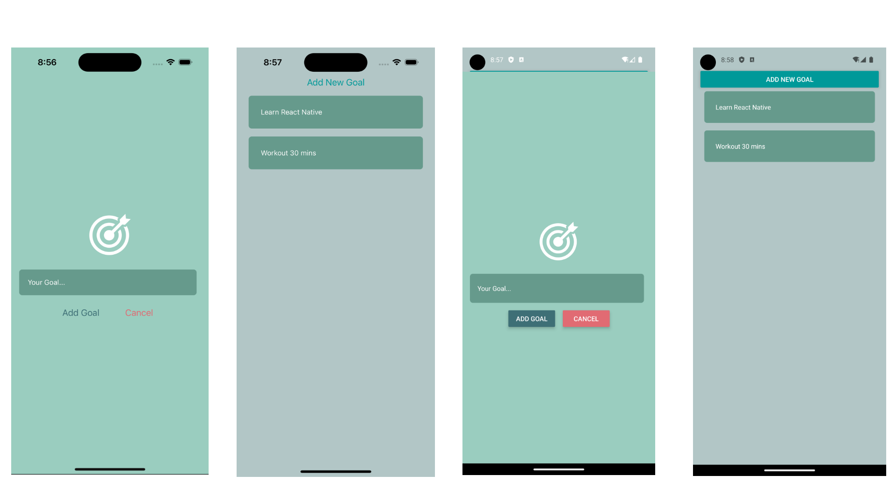

# goalsApp_react_native

## Description

A goals list App build with React Native for ios and android.

## Usage



## Table of Contents

- [Description](#description)
- [Installation](#installation)
- [Usage](#usage)
- [Built_With](#built-with)
- [Tools](#tools)
- [License](#license)

## Installation

```
 git clone https://github.com/ollyhite/goalsApp_react_native
```

- create a file
- open terminal and cd the file name you created
- git clone with my repo link (can copy Installation section's first line)
- cd in the goalsApp_react_native file
- enter "npm i" to install the node_module

```
    npm i
```

- next run npm start to open your Expo Go/Simulators/Android Studio

```
    npm start
```

## Built With

- React Native

## Tools

- Expo Go
- Simulators
- Android Studio

## Author Info & Getting Help

- [Pei-Yun Hite's LinkedIn](https://www.linkedin.com/in/peiyunhite/)
- [Pei-Yun Hite's Github Link](https://github.com/ollyhite)
- [Pei-Yun Hite's Portfolio](https://www.peiyunhite.com/)
- Send Questions or suggestions for changes to the readme_generator_tool project maintainer, [Pei-Yun Hite](mailto:peiyunhite@gmail.com?subject=[GitHub]%20employee_organizer%20) , for consideration.

## License

MIT License
Copyright (c) 2023 Pei-Yun Hite
Permission is hereby granted, free of charge, to any person obtaining a copy of this software and associated documentation files (the "Software"), to deal in the Software without restriction, including without limitation the rights to use, copy, modify, merge, publish, distribute, sublicense, and/or sell copies of the Software, and to permit persons to whom the Software is furnished to do so, subject to the following conditions:
The above copyright notice and this permission notice shall be included in all copies or substantial portions of the Software.
THE SOFTWARE IS PROVIDED "AS IS", WITHOUT WARRANTY OF ANY KIND, EXPRESS OR IMPLIED, INCLUDING BUT NOT LIMITED TO THE WARRANTIES OF MERCHANTABILITY, FITNESS FOR A PARTICULAR PURPOSE AND NONINFRINGEMENT. IN NO EVENT SHALL THE AUTHORS OR COPYRIGHT HOLDERS BE LIABLE FOR ANY CLAIM, DAMAGES OR OTHER LIABILITY, WHETHER IN AN ACTION OF CONTRACT, TORT OR OTHERWISE, ARISING FROM, OUT OF OR IN CONNECTION WITH THE SOFTWARE OR THE USE OR OTHER DEALINGS IN THE SOFTWARE.

[https://choosealicense.com/licenses/mit/](https://choosealicense.com/licenses/mit/)
